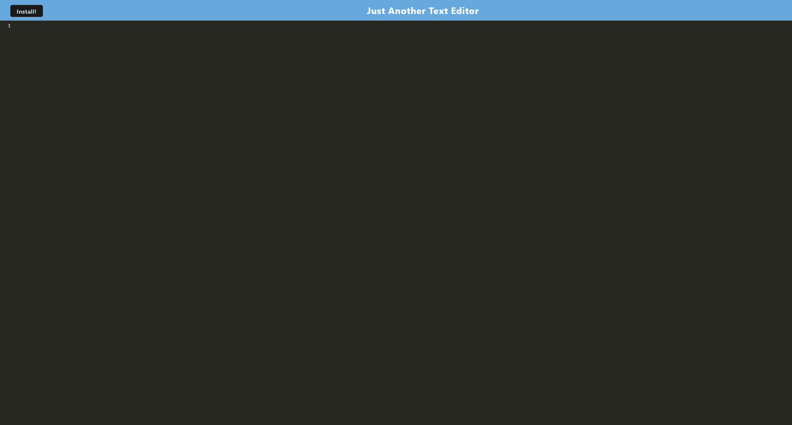

# PWA Text Editor

## Table of Contents
- [Description](#description)
- [Installation](#installation)
- [Node Packages](#node-packages)
- [License](#license)

## Description
A progressive web application that uses JATE with IndexDB to behave as a text editor. This application allows users to create and save text documents directly in their browser, providing a seamless and efficient text editing experience.

[](https://mikematics22800.github.io/PWA-Text-Editor)

## Installation

```bash
# Navigate to your desired directory
cd path/to/your/desired/directory
# Clone the repository
git clone https://github.com/mikematics22800/PWA-Text-Editor
# Enter the project directory
cd PWA-Text-Editor
# Install dependencies
npm install
# Start the development server
npm run start:dev
```
## Node Packages
Express | JATE | IndexDB | Webpack | Workbox

## License
[](https://opensource.org/licenses/ISC)
